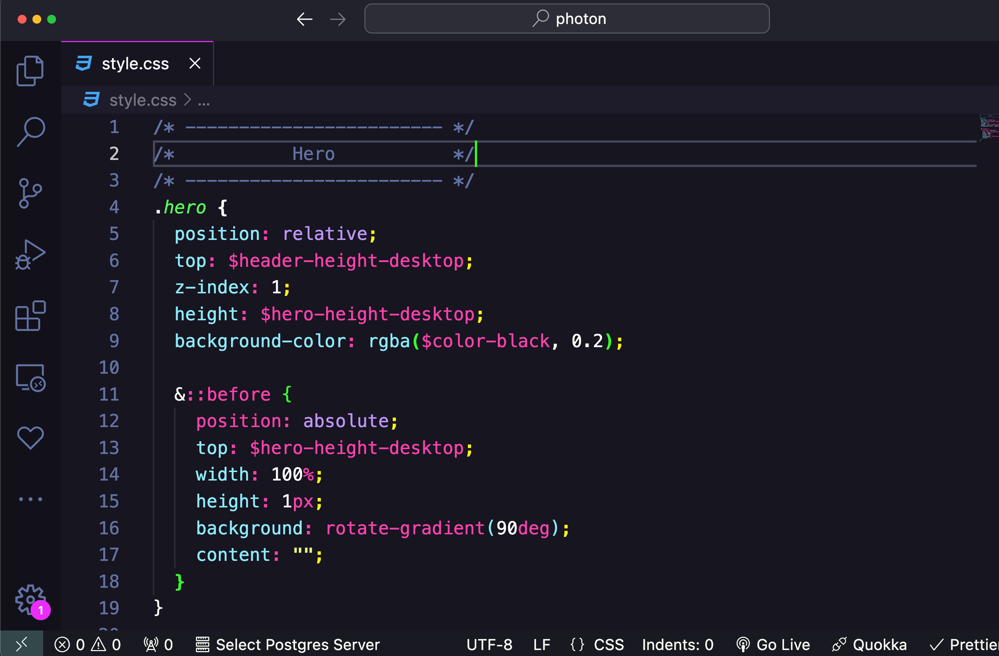

# Photon VSCode Theme

Photon is a **high-contrast** VSCode theme inspired by the [Dracula Theme](https://github.com/dracula/dracula-theme). This project modifies the original theme to create a unique look and feel.

## License

Photon is licensed under the MIT License. See the `LICENSE.md` file for details.

## Attributions

- **Icons:** [Photon](https://www.flaticon.com/free-icons/photon) icon created by [Flat Icons](https://www.flaticon.com/authors/flat-icons) from [Flaticon](https://www.flaticon.com).
